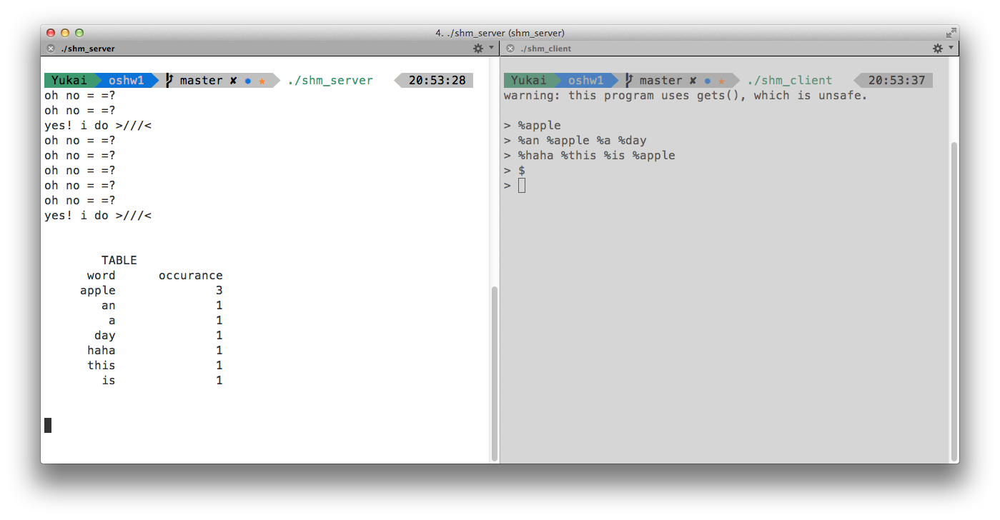

#Operating System Homework 1 - Shared Memory

##Screenshots

##Usage
compile source code using gcc: 	

	gcc shm_client.c -o shm_client -lrt
	gcc shm_server.c -o shm_server -lrt

note: if you're using OSX, then you can ignore `-lrt` flag

and start both program

	./shm_client
	./shm_server

You can enter a word or a sentence once each word starts with '%'

For example, in the prompt enter: 

	> %an %apple %a %day %keeps %the %doctor %away
	> %if %one %is %not %enough %you %should %take %two

then get the result by entering '$' sign

	> $

now you get your word frequency on server side terminal
